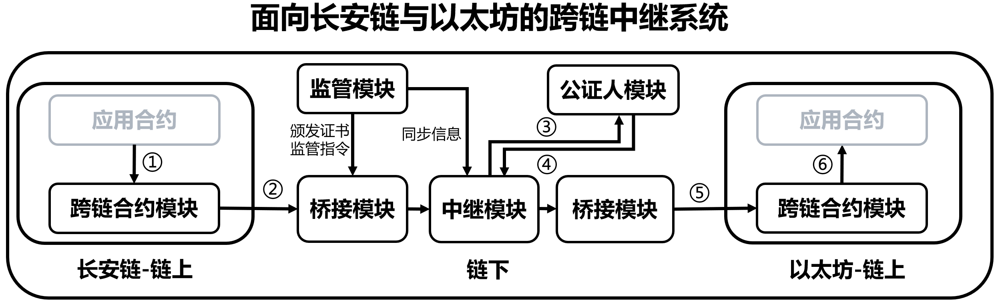

### 目录

[TOC]

**长安链/chainmaker：cc 				以太坊/ethereum：eth**

#### 共享文件夹备份 

cd ~

find gradu_design/ -type l -delete *[删除符号链接文件]*

rsync -av --delete gradu_design/ /mnt/hgfs/share1/gradu_design_bak/ *[正向]* [rsync详解](https://www.ruanyifeng.com/blog/2020/08/rsync.html)

rsync -av --delete /mnt/hgfs/share1/gradu_design_bak/ gradu_design/ *[反向]*

#### 系统初步设计（帮助理解的简略图）

#### 建议

1. 桥接模块和链的关系，中继模块是否唯一（各个模块的归属）
2. 监管：多维度的接口，各个模块都能体现
3. 分层设计
4. 每个模块功能总结后再详解

1. **监管模块**

   1. 为进行跨链的区块链分配域名、颁发证书；存储跨链系统所需的证书、域名路由等信息。
   2. 监管模块需具备下发和接收监管指令的能力，并有较高的管理权限，例如下发中继模块撤销某条接入区块链的跨链权限、对各接入区块链、链上用户进行访问控制授权和撤回。
   3. 管理跨链事件，将桥接模块/中继模块推送过来的跨链消息组织落盘存储，用于实现对跨链消息的监管和追溯。

2. **跨链合约模块**

   1. 包含系统合约，给应用合约提供跨链接口。
   2. 执行发送方交易请求时，需验证交易发起者是否有权限发送跨链请求，验证通过后应用合约才能跨合约调用跨链合约，并最终抛出跨链响应事件。
   3. 执行接收方交易请求时，需接收桥接模块发送的跨链消息，并在跨链合约跨合约调用相应的目标应用合约完成跨链请求。

3. **桥接模块**

   连接跨链系统链下中继模块和各区块链的关键模块，用于接收监管模块的监管指令。

   1. 执行发送方交易请求时，需监听链上抛出的跨链事件。根据规范重构跨链消息（例如包含源链的数字证书签名、目标链域名、跨链消息等），并转发至中继模块。
   2. 执行接收方交易请求时，接收中继模块转发的跨链消息，解构跨链消息后发送到目标链上的跨链合约。

4. **中继模块**

   1. 同步监管模块的证书信息，提供给其他各模块访问。
   2. 接收桥接模块转发的跨链消息后，转发到公证人模块验证交易的真实性，在收到跨链消息和公证人的验证证明后，解析消息中的接收链域名，发送给正确的接收链（若没有存储该路由信息则询问监管模块并存储）。

5. **公证人模块**

   1. 验证交易源链证书的真实性（向中继模块请求验证时的必要信息），验证跨链消息的真实性，只有一定比例的公证人分别对消息和证书进行背书，该跨链交易才能被跨链系统承认并执行转发等后续流程。验证完成的跨链消息和背书证明将被发送回桥接模块。

   

#### 系统设计建议

1. 这套系统最重要的就是中继模块和公证人模块，其中中继模块负责跨链消息接收和转发的全盘协调工作，并且未来需要扩充该跨链系统都是在中继模块扩充；公证人模块则是完成跨链消息的验证，是一个一劳永逸的模块，功能就是验证消息的真实性，这里一定要想清楚该怎么设计，以及为什么这样设计就能保证消息存在性、真实性可靠。
2. 中继模块
   1. 第一版可以做简单一点，能做好消息的路由就可以了，就是说在一条新的区块链接入的时候，由中继模块向上告诉监管模块，获得域名等信息，在监管模块保存，拿到监管模块颁发的域名等信息后，在中继模块也可以存一下（相当于cache或者不断更新的路由表，这个就可以简单可以复杂了），然后在链上部署跨链合约，以上是区块链接入注册；
   2. 之后中继模块就是消息的接收和转发驱动了，比如桥接模块监听到消息后，转发到中继模块，中继模块拿着消息去公证人模块要验证，拿到验证后再根据跨链消息解析出目标链，根据本地路由表，把带有公证人签名的跨链消息发送到相应的桥接模块完成转发。
3. 如果想都做得很好会导致工作量太大，建议每个模块都实现各最基础的版本，比如桥接模块就封装两个接口：监听事件、发送交易；监管模块就封装三个接口：授权、撤权、存储和查找。
4. **【总结】公证人模块相当于Antchain的PTC，中继模块和桥接模块相当于Antchain的Relayer，监管模块相当于Antchain的BCDNS，跨链合约相当于Antchain的SysContracts.**

#### 系统实现流程

1. 区块链A要加入系统，首先得获取域名。数据流：此区块链的某客户端通过网络端口向中继模块提交申请，中继模块转发给监管模块
   
   **C ST O  OU CN**
   
   **每个网络模块写一个函数，访问127.0.0.1：4400的时候就返回自己的基本信息！用于验证**
   
   - 先只填写信息用于给出去，签名验证这些基本功能弄完了再做https://www.bilibili.com/video/BV1xE411N7SP/
   
   1. 监管程序生成自签名证书**（创建一个index_domain文件存储申请者域名和生成的证书的对应关系）**
      1. mkdir demoCA ./demoCA/certs ./demoCA/crl ./demoCA/newcerts ./demoCA/private ./demoCA/csr
      2. touch ./demoCA/index.txt; echo "01" > ./demoCA/serial
      3. openssl genrsa -out ./demoCA/private/cakey.pem   # 创建CA的私钥
      4. openssl req -new -key ./demoCA/private/cakey.pem -out ./demoCA/csr//ca.csr -config openssl.cnf -batch   # 创建CA待自签署的证书请求文件
      5. openssl ca -selfsign -in ./demoCA/csr/ca.csr -config openssl.cnf -batch   # 自签署
      6. cp ./demoCA/newcerts/01.pem ./demoCA/cacert.pem   # 将自签署的证书按照配置文件的配置复制到指定位置
   
   2. 中继模块向监管模块申请证书
      1. openssl genrsa -out privkey.pem
      2. openssl req -new -out relayer.csr -config openssl.cnf -batch
   
   3. 区块链A发送域名和身份信息给中继模块
   
      **申请者证书:OU存域名,CN存eth.json的哈希**
   
      1. 例如通过一个apply程序获得区块链A的必要配置信息eth.json作为身份，和自定义的string类型的域名发送给中继模块
   
   4. 中继模块向监管模块申请域名
   
   5. 中继模块将申请的域名和区块链A绑定（domain & eth.json）
   
2. 
